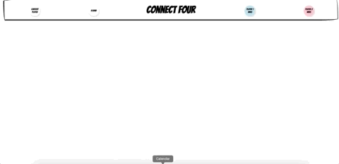

# Connect Four Game
Connect Four game created as one of the assignments at Spiced Academy Bootcamp

## Table of contents
* [Technologies](#technologies)
* [Features](#features)
* [Showroom](#showroom)

## Technologies
Project is created with:
* HTML, 
* CSS
* JavaScript - JQuery;

## Setup
Clone this repo to your desktop.

## Features
* The first player to get their pieces into four slots that are vertically, horizontally, or diagonally contiguous wins the game
* Two players take turns selecting a column to drop their checker into
* When a player wins, a message appears to announce the victory
* After a player wins, it is possible to reset the game and play again

## Showroom
[magali-gs.github.io/connect4/](magali-gs.github.io/connect4/)

